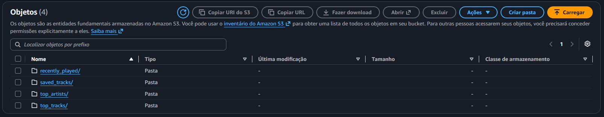

# veridis 🎧

A data engineering project exploring my personal listening habits on Spotify. It combines data extracted via the **official Spotify API** with a larger historical dataset of global streams (Kaggle), building an end-to-end data pipeline: extraction → cloud storage (AWS S3) → transformation → SQL modeling → final Power BI dashboard.

> Name inspired by Daft Punk's "Veridis Quo".

## Project status

🚧 Under construction — currently working on the API extraction phase.

## Getting started

### 1. Clone the repository and navigate to the directory
```bash
git clone https://github.com/JGois1/Veridis.git
cd veridis
```

### 2. Create a virtual environment
```bash
python -m venv venv
source venv/bin/activate    # Windows: venv\Scripts\activate
```

### 3. Install dependencies
```bash
pip install -r requirements.txt
```

### 4. Set up your credentials
Copy the sample file and fill in your credentials from the [Spotify Developer Dashboard](https://developer.spotify.com/dashboard):

```bash
cp .env.example .env
```

Then edit `.env` with your `SPOTIFY_CLIENT_ID` and `SPOTIFY_CLIENT_SECRET`.

### 5. Test the connection
```bash
python src/auth_test.py
```

This will open your browser requesting Spotify login and authorization, then print your top 5 recently played tracks in the terminal.

## Architecture (planned)

```
[Spotify API] ─┐
               ├─→ [Python Extraction] → [S3: Raw Data] → [Transformation]
[Kaggle CSV] ──┘                                                 │
                                                                 ▼
                                                [SQL: Modeling] → [Power BI]
```

## Tech stack

- Python (spotipy, pandas)
- AWS S3
- SQL
- Power BI
- Git/GitHub

## Results so far

### Organized raw data in S3

Files extracted from the Spotify API are automatically uploaded to the bucket, partitioned by data type (top tracks, top artists, recently played, saved tracks):



## Next steps

- [ ] Test authentication
- [ ] Extract top tracks, top artists, and audio features
- [ ] Upload raw data to S3
- [ ] Download and explore Kaggle dataset
- [ ] Transform and unify both data sources
- [ ] Model data in SQL
- [ ] Build Power BI dashboard
