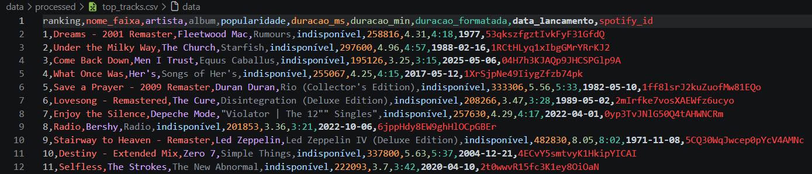

# veridis 🎧

A data engineering project exploring my personal listening habits on Spotify. It combines data extracted via the **official Spotify API** with a larger historical dataset of global streams (Kaggle), building an end-to-end data pipeline: extraction → cloud storage (AWS S3) → transformation → SQL modeling → dataset merging → final Power BI dashboard.

> Name inspired by Daft Punk's "Veridis Quo".

## Project status

🚧 Under construction — extraction, cloud storage, transformation, SQL modeling, and the Kaggle data merge are done. Currently working on the Power BI dashboard.

## Getting started

### 1. Clone the repository and navigate to the directory
```bash
git clone https://github.com/JGois1/Veridis.git
cd veridis
```

### 2. Create a virtual environment
```bash
python -m venv venv
source venv/bin/activate    # Windows: venv\Scripts\activate
```

### 3. Install dependencies
```bash
pip install -r requirements.txt
```

### 4. Set up your credentials
Copy the sample file and fill in your credentials from the [Spotify Developer Dashboard](https://developer.spotify.com/dashboard) and your [AWS IAM user](https://console.aws.amazon.com/iam):

```bash
cp .env.example .env
```

Then edit `.env` with your `SPOTIFY_CLIENT_ID`, `SPOTIFY_CLIENT_SECRET`, `AWS_ACCESS_KEY_ID`, and `AWS_SECRET_ACCESS_KEY`.

### 5. Download the Kaggle dataset
Download the [Spotify Tracks Dataset](https://www.kaggle.com/datasets/maharshipandya/-spotify-tracks-dataset) and place the CSV file in `data/external/`.

### 6. Test the connection
```bash
python src/auth_test.py
```

This will open your browser requesting Spotify login and authorization, then print your top 5 recently played tracks in the terminal.

### 7. Run the pipeline
```bash
python src/extract.py         # pulls data from the Spotify API into data/raw/
python src/upload_to_s3.py    # uploads raw JSON files to the S3 bucket
python src/transform.py       # cleans and structures the data into data/processed/
python src/load_to_sql.py     # loads the processed CSVs into a SQLite database
python src/queries.py         # runs example SQL queries against the database
python src/merge_kaggle.py    # merges personal top tracks with the Kaggle dataset
```

## Architecture

```
[Spotify API] ─┐
               ├─→ [Python Extraction] → [S3: Raw Data] → [Transformation]
[Kaggle CSV] ──┘                                                 │
                                                                  ▼
                                          [SQLite: Modeling] → [Merge] → [Power BI]
```

## Tech stack

- Python (spotipy, pandas, boto3)
- AWS S3
- SQLite
- SQL
- Power BI
- Git/GitHub

## Results so far

### Organized raw data in S3

Files extracted from the Spotify API are automatically uploaded to the bucket, partitioned by data type (top tracks, top artists, recently played, saved tracks):


### Extracted and processed top tracks data

Data extracted from the Spotify API structured into clean CSV format, enriched with converted duration fields, rankings, and track metadata:



### SQL modeling and analysis

Processed CSVs are loaded into a SQLite database and queried with SQL to answer questions about listening habits — including artist frequency, track duration, release decade distribution, cross-table joins between top tracks and saved tracks, and listening patterns by day of week and time of day.

### Merging with the Kaggle dataset

Personal top tracks are matched against a ~114,000-track public dataset by normalized track name and artist, bringing in genre and audio features (danceability, energy, valence, tempo, acousticness) that the Spotify API no longer exposes to newly created apps. About a third of personal top tracks find a match — the rest are genuinely absent from the public dataset (niche artists, or tracks outside its sample).

## Notes on design decisions

- **SQLite over a hosted database**: chosen to keep the project lightweight and focused on learning the SQL layer itself. The connection logic is isolated in `load_to_sql.py`, so migrating to a managed database (e.g., PostgreSQL on AWS RDS) later would only require changing the connection method, not the SQL queries themselves.
- **Defensive field access (`.get()` instead of `[]`)**: Spotify has restricted certain fields (like `popularity` and `genres`) for newly created apps. Using `.get()` with fallback values keeps the pipeline resilient to these kinds of upstream API changes instead of breaking.
- **Matching only on the first artist**: the Kaggle dataset joins collaborators into a single field separated by `;` (e.g. `"Charlie Puth;Selena Gomez"`), while the personal data only keeps the primary artist. The merge logic normalizes both sides to just the first artist so featured collaborations still match correctly.
- **Requiring both track name and artist to match**: matching on track name alone would incorrectly pair original tracks with unrelated covers by other artists that happen to exist in the dataset (confirmed while investigating unmatched tracks). Requiring both fields avoids pulling in audio features from the wrong recording.
- **Aggregating duplicate genre rows**: the Kaggle dataset repeats the same track once per genre it's tagged with. Instead of arbitrarily keeping just one row (and losing genre information), matching rows are grouped so all genres for a track are combined into a single field.

## Next steps

- [x] Test authentication
- [x] Extract top tracks, top artists, recently played, and saved tracks
- [x] Upload raw data to S3
- [x] Transform and clean the extracted data
- [x] Model data in SQL (SQLite)
- [x] Download and explore Kaggle dataset
- [x] Merge Spotify data with the Kaggle dataset
- [ ] Build Power BI dashboard
