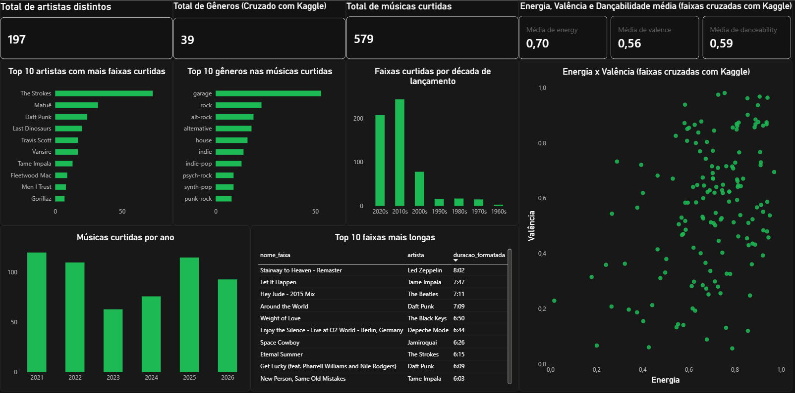
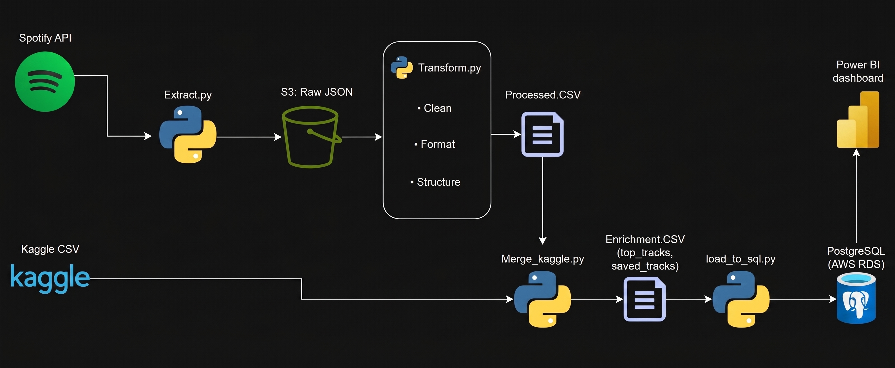
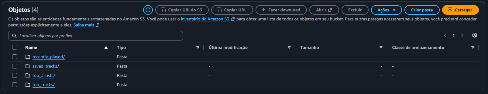
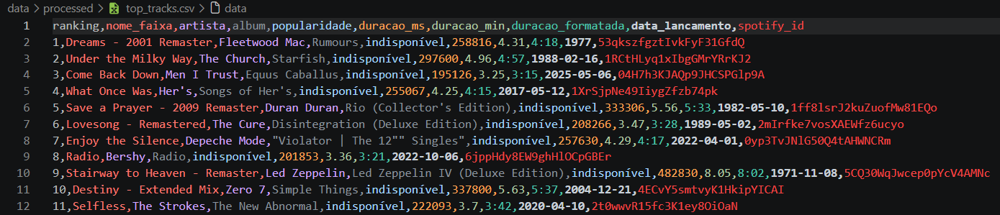

# Veridis 🎧

A data engineering project exploring my personal listening habits on Spotify. It combines data extracted via the **official Spotify API** with a larger public dataset of tracks (Kaggle), building an end-to-end data pipeline: extraction → cloud storage (AWS S3) → transformation → dataset merging → SQL modeling (PostgreSQL on AWS RDS) → Power BI dashboard.

> Name inspired by Daft Punk's "Veridis Quo".



## Dashboard

Built in Power BI on top of the PostgreSQL database. It covers the full liked-songs library (~580 tracks):

- **KPIs**: liked tracks, distinct artists, distinct genres, average energy, valence and danceability
- **Top 10 artists** and **top 10 genres** across the library
- **Liked tracks by release decade** and **by year they were liked**
- **Energy × valence scatter plot**, one dot per track
- **Top 10 longest tracks**

The genre and audio-feature visuals only cover the tracks matched in the Kaggle dataset (roughly a third of the library) and are labeled accordingly.

The Power BI file is in `dashboard/veridis.pbix`. It uses Import mode, so the data is embedded in the file and no database connection is needed to open it.

## Architecture



| Script | Stage | What it does |
|---|---|---|
| `extract.py` | Extract | Pulls top tracks, top artists, recently played, and the full saved-tracks library (paginated) into `data/raw/` as JSON |
| `upload_to_s3.py` | Raw storage | Uploads the raw JSON files to S3, partitioned by data type |
| `transform.py` | Transform | Flattens the JSON, keeps the relevant fields, fixes types, and writes CSVs to `data/processed/` |
| `merge_kaggle.py` | Enrich | Matches tracks against the Kaggle dataset to add genres and audio features, and builds a one-row-per-genre table |
| `load_to_sql.py` | Load | Loads the processed CSVs into PostgreSQL on AWS RDS |
| `queries.py` | Analysis | Example SQL queries over the loaded tables |
| `auth_test.py` | Utility | Checks that Spotify authentication works |
| `playground.py` | Utility | Menu for exploring API endpoints freely |

## Tech stack

- Python (spotipy, pandas, boto3, sqlalchemy, psycopg2)
- AWS S3
- AWS RDS (PostgreSQL)
- SQL
- Power BI
- Git/GitHub

## Getting started

### 1. Clone the repository and navigate to the directory
```bash
git clone https://github.com/JGois1/Veridis.git
cd Veridis
```

### 2. Create a virtual environment
```bash
python -m venv venv
source venv/bin/activate    # Windows: venv\Scripts\activate
```

### 3. Install dependencies
```bash
pip install -r requirements.txt
```

### 4. Set up your credentials
Copy the sample file and fill in your credentials from the [Spotify Developer Dashboard](https://developer.spotify.com/dashboard), your [AWS IAM user](https://console.aws.amazon.com/iam), and your [AWS RDS instance](https://console.aws.amazon.com/rds):

```bash
cp .env.example .env
```

Then edit `.env` with your `SPOTIFY_CLIENT_ID`, `SPOTIFY_CLIENT_SECRET`, `AWS_ACCESS_KEY_ID`, `AWS_SECRET_ACCESS_KEY`, and the `DB_*` connection variables.

### 5. Download the Kaggle dataset
Download the [Spotify Tracks Dataset](https://www.kaggle.com/datasets/maharshipandya/-spotify-tracks-dataset) and place the CSV file in `data/external/`.

### 6. Test the connection
```bash
python src/auth_test.py
```

This opens your browser for Spotify login and authorization, then prints your top 5 recent tracks in the terminal.

### 7. Run the pipeline
```bash
python src/extract.py         # pulls data from the Spotify API into data/raw/
python src/upload_to_s3.py    # uploads raw JSON files to the S3 bucket
python src/transform.py       # cleans and structures the data into data/processed/
python src/merge_kaggle.py    # enriches tracks with Kaggle genres and audio features
python src/load_to_sql.py     # loads every CSV in data/processed/ into PostgreSQL
python src/queries.py         # runs example SQL queries against the database
```

`merge_kaggle.py` has to run before `load_to_sql.py`, because the loader picks up every CSV in `data/processed/`, including the enriched ones.

## Results

### Organized raw data in S3

Files extracted from the Spotify API are uploaded to the bucket, partitioned by data type (top tracks, top artists, recently played, saved tracks):



### Processed tracks data

Extracted data structured into clean CSV format, with converted duration fields, rankings, and track metadata:



### SQL analysis (PostgreSQL on AWS RDS)

The processed CSVs are loaded into PostgreSQL and queried to answer questions about listening habits: artist frequency, track duration, release decade distribution, joins between top tracks and saved tracks, and listening patterns by day of week and time of day.

### Merge with the Kaggle dataset

Tracks are matched against a ~114,000-track public dataset by normalized track name and artist, bringing in genres and audio features (danceability, energy, valence, tempo, acousticness) that the Spotify API no longer exposes to newly created apps. About a third of the library finds a match; the rest is absent from the public dataset (niche artists, or tracks outside its sample).

## Notes on design decisions

- **Migrating from SQLite to PostgreSQL (AWS RDS)**: the project started on SQLite to focus on the SQL layer without infrastructure overhead. Once the pipeline worked, it moved to a managed PostgreSQL instance on AWS RDS, which is closer to production setups and connects natively to Power BI (SQLite needs a third-party ODBC driver). Because the connection logic was isolated in `load_to_sql.py`, the migration only changed the connection method and a few date functions (`strftime()` → `EXTRACT()`).
- **Explicit datetime parsing before loading**: PostgreSQL enforces column types strictly. Timestamp columns read from CSV as plain text must be converted with `pd.to_datetime()` first, otherwise functions like `EXTRACT()` fail against a text column.
- **Pagination for saved tracks**: the API returns at most 50 items per call, so `extract_saved_tracks` loops with an increasing `offset` until a page comes back short. The other endpoints (top tracks, top artists, recently played) are capped at 50 by Spotify itself and cannot be paginated further, which is why the dashboard uses the saved-tracks library as its main dataset.
- **Defensive field access (`.get()` instead of `[]`)**: Spotify restricted certain fields (like `popularity`, `genres` and audio features) for newly created apps. Using `.get()` with fallback values keeps the pipeline from breaking on these upstream changes.
- **Matching on first artist plus track name**: the Kaggle dataset joins collaborators into one field separated by `;`, while the personal data keeps only the primary artist. Both sides are normalized to the first artist. Requiring the artist to match, and not only the track name, avoids pairing an original track with an unrelated cover that exists in the dataset.
- **Group first, then explode genres**: Kaggle repeats each track once per genre. Before merging, rows are grouped per track so the merge does not duplicate personal tracks. Afterwards, `saved_tracks_generos` is built with one row per track and genre, so the BI tool counts genres correctly instead of treating "indie, indie-pop" as a single category.
- **Power BI in Import mode**: the dashboard file embeds its data, so it opens without access to the database. Refreshing it does require a live connection.

## Limitations

- Top tracks, top artists and recently played are limited to 50 items by the Spotify API.
- Spotify no longer returns audio features, popularity or artist genres to newly created apps, so the Kaggle dataset fills that gap. Its sample covers only part of the library.
- Genres and audio features come from the Kaggle dataset's own labeling, not from Spotify.
